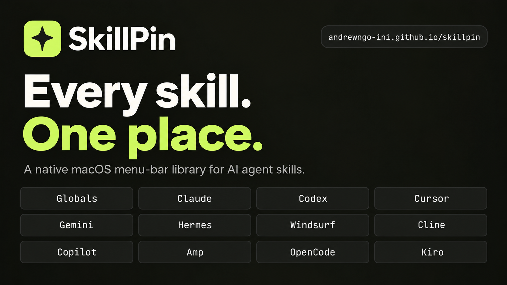

<h1 align="center">SkillPin</h1>

<p align="center">A native macOS menu-bar library for AI agent skills.</p>

<p align="center">
  <a href="https://github.com/AndrewNgo-ini/skillpin/releases/latest"></a>
  
  <a href="https://github.com/AndrewNgo-ini/homebrew-skillpin"></a>
  <a href="LICENSE"></a>
  <a href="https://andrewngo-ini.github.io/skillpin/"></a>
</p>

<p align="center">
  <a href="https://andrewngo-ini.github.io/skillpin/"></a>
</p>

<p align="center"><a href="https://andrewngo-ini.github.io/skillpin/"><b>andrewngo-ini.github.io/skillpin</b></a> · <a href="https://github.com/AndrewNgo-ini/skillpin/releases/latest/download/SkillPin.dmg">Download for macOS</a> · <code>brew install --cask andrewngo-ini/skillpin/skillpin</code></p>

Agent skills are folders with a `SKILL.md` file, and every agent reads them from
its own directory. The same skill ends up copied into `~/.agents/skills`,
`~/.claude/skills`, and a `.claude/skills` folder inside two of your
repositories. Nothing shows you the whole set, so you run `ls` in four places
and open files to read the frontmatter.

SkillPin reads all of those directories and shows one list. Each entry is the
skill; underneath it are the places that skill is currently available.

## The pin model

A skill is canonical. A **pin** is a location where that skill is available.

```
research                       one skill
├── ~/.agents/skills/          Globals
├── ~/.claude/skills/          Claude
└── ./.agents/skills/          Project: moonfish
```

Pinning to the globals directory, `~/.agents/skills`, is the default, because
every conforming agent reads it whichever tool you are in. The per-agent formats
(`.claude`, `.codex`, `.hermes`) are there when you need them and hidden when
you don't. Project pins copy the skill into the repository, so the repository
stays portable and can commit the skills it depends on.

## What it does

- Finds every agent directory on your machine, then lists their skills deduplicated by name, with the description from each `SKILL.md` frontmatter
- Shows the pins for each skill, marked global or project
- Groups skills in the globals directory by the repository they were installed from, read from `~/.agents/.skill-lock.json`, with anything unrecorded under `Local / untracked`
- Searches names and descriptions, and filters by Globals, Projects, or any single agent you have installed
- Adds a project folder and scans its local skill directories by the same rule
- Pins a skill to Global or a project in any agent's format, always as a copy
- Runs from the menu bar with no dock icon and no window to manage

## Directories it reads

SkillPin does not carry a list of supported agents. It looks in your home
folder for any dot-directory containing a `skills` folder, so an agent it has
never heard of shows up without a new release:

```
~/.agents/skills/     →  Globals
~/.claude/skills/     →  Claude
~/.cursor/skills/     →  Cursor
~/.whatever/skills/   →  Whatever
```

The same rule runs inside each project folder you add, and Hermes gets one
extra root per profile in `~/.hermes/profiles/<name>/skills/`.

Thirteen agents are recognised by name and given their own badge icon — Globals,
Claude, Codex, Cursor, Copilot, Gemini, Kimi, Grok, OpenCode, Cline, Goose,
Hermes and Pencil. Anything else is listed under its capitalised directory
name. Adding a recognised agent is one line in `AgentProvider.known`.

## Install

macOS 14 or later. No external dependencies.

Download [SkillPin.dmg](https://github.com/AndrewNgo-ini/skillpin/releases/latest/download/SkillPin.dmg)
and drag SkillPin to Applications, or install it with Homebrew:

```sh
brew install --cask andrewngo-ini/skillpin/skillpin
```

The build is not signed with an Apple Developer ID yet, so macOS asks you to
approve it once under System Settings → Privacy & Security.

To build from source instead:

```sh
git clone https://github.com/AndrewNgo-ini/skillpin.git
cd skillpin
./Scripts/package-app.sh      # builds dist/SkillPin.app
open dist/SkillPin.app
```

To run it straight from the terminal instead:

```sh
swift run SkillPin
```

## What pinning does

Every pin is a copy. The app never creates a symlink.

A skill can be in several places, and in several formats at each place: Global
has `~/.agents/skills`, `~/.claude/skills`, `~/.codex/skills`, …; a project has
the same set under its own root. That is a grid, places × formats, and the
**Pin** menu at the end of an expanded row shows it one place at a time:

```
Pin ▾
  ✓ Global  ·  2        ▸   ✓ Globals (.agents)
    contextbox-harness  ▸   ✓ Claude (.claude)
    api-server          ▸     Codex (.codex)
  ──────────────              Cursor (.cursor)
  Choose project…             Hermes (.hermes)
                              Pencil (.pencil)
```

The top level is the places; each opens its formats. A place row shows a
checkmark and a count when any format there holds the skill.

A tick is presence in that cell. Choosing an unticked row copies the skill's
folder to `<place>/<format>/skills/<name>`; choosing a ticked row removes it
there. One click, one cell. `.agents` leads each submenu because it is the
place skills are kept; the agent rows beside it are what each agent actually
reads. Choose project… adds a repository and copies the skill into its
`.agents`; other formats are one more click in its submenu.

Hermes and Pencil rows are refused when unticked, with the reason: Hermes
nests skills in category folders, so a flat entry would not be read, and
Pencil's directory holds Pencil's own skills. Skills already there still show
as ticks and can be removed.

Removing a folder asks first and names any symlinks elsewhere that point at
it; if the copy has drifted from the canonical one, the dialog offers to
replace it instead.

**Symlinks you already have.** Installers link agent directories into
`.agents`; on this machine `~/.claude/skills` holds 39 such links. SkillPin
follows them when scanning, marks them with a link glyph on the badge, removes
one cleanly when you untick it, and warns before deleting a folder they point
at. It does not make new ones.

Copies are checked against the canonical folder when you expand a skill. A copy
that differs carries an amber mark on its badge.

## Status

Version 0.1.2. Browsing, search, filters, project scanning, reading, pinning,
unpinning and drift detection between copies all work. What it cannot tell you
is whether Globals itself has drifted from the GitHub repository it was
installed from; the installer's folder hash in `~/.agents/.skill-lock.json`
would answer that, but its algorithm is not published. Releases are ad-hoc
signed; a Developer ID signature and notarization come next.

## Development

```sh
swift run SkillPin
swift test
```

`Sources/SkillPin/SkillCatalog.swift` walks the roots and parses frontmatter.
`AgentProvider.swift` is the agent table and the directory discovery rule.
`SkillPinner.swift` plans and performs a copy, and reports what is at a path.
`SkillDrift.swift` hashes folders and replaces a drifted copy.
`SkillPinDomain.swift` holds the scope/destination model.
`SkillPinApp.swift` is the SwiftUI menu-bar interface.

## Contributing

Issues and pull requests are welcome. For a bug report, include your macOS
version and the skill directory that reproduces it.

## License

MIT. See [LICENSE](LICENSE).
