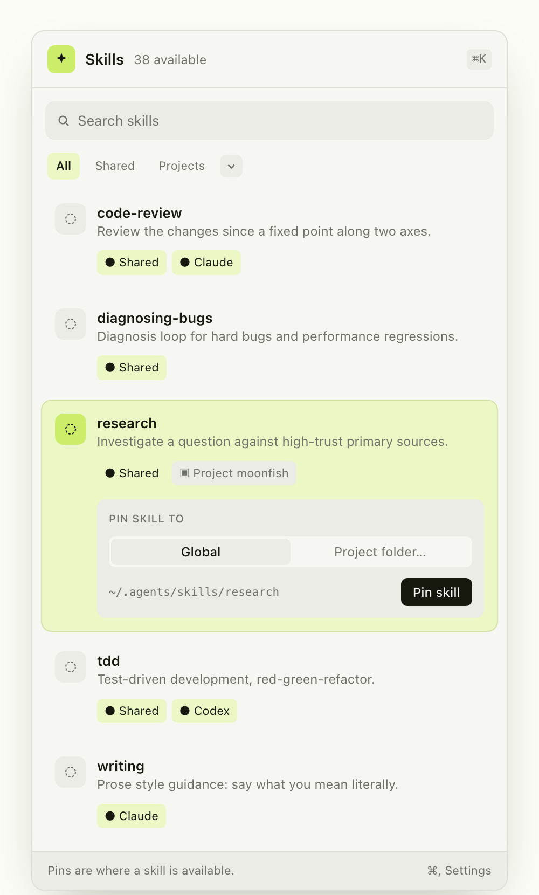

<h1 align="center">SkillPin</h1>

<p align="center">A native macOS menu-bar library for AI agent skills.</p>

<p align="center">
  
</p>

Agent skills are folders with a `SKILL.md` file, and every agent reads them from
its own directory. The same skill ends up copied into `~/.agents/skills`,
`~/.claude/skills`, and a `.claude/skills` folder inside two of your
repositories. Nothing shows you the whole set, so you run `ls` in four places
and open files to read the frontmatter.

SkillPin reads all of those directories and shows one list. Each entry is the
skill; underneath it are the places that skill is currently available.

## The pin model

A skill is canonical. A **pin** is a location where that skill is available.

```
research                       one skill
├── ~/.agents/skills/          Shared
├── ~/.claude/skills/          Claude
└── ./.agents/skills/          Project: moonfish
```

Pinning to the shared `.agents/skills` directory is the default, because agents
that follow the shared convention all read it. The per-agent formats
(`.claude`, `.codex`, `.hermes`) are there when you need them and hidden when
you don't. Project pins copy the skill into the repository, so the repository
stays portable and can commit the skills it depends on.

## What it does

- Lists every skill from every known directory, deduplicated by name, with the description from its `SKILL.md` frontmatter
- Shows the pins for each skill, marked global or project
- Names where a shared skill came from, read from `~/.agents/.skill-lock.json` — a GitHub repository, or `Local / untracked`
- Searches names and descriptions, and filters by Shared, Projects, Claude, Codex, or Hermes
- Adds a project folder and scans its four local skill directories
- Runs from the menu bar with no dock icon and no window to manage

## Directories it reads

| Path | Shown as |
| --- | --- |
| `~/.agents/skills/` | Shared |
| `~/.claude/skills/` | Claude |
| `~/.codex/skills/` | Codex |
| `~/.hermes/skills/` | Hermes |
| `~/.hermes/profiles/<name>/skills/` | Hermes `<name>` |
| `<project>/.agents\|.claude\|.codex\|.hermes/skills/` | Project `<name>` |

## Install

macOS 14 or later. No external dependencies.

```sh
git clone https://github.com/AndrewNgo-ini/skillpin.git
cd skillpin
./Scripts/package-app.sh      # builds dist/SkillPin.app
open dist/SkillPin.app
```

To run it straight from the terminal instead:

```sh
swift run SkillPin
```

## Status

Version 0.1.0. Reading, searching, filtering, and project scanning work.
Writing a pin from the app is not implemented yet — the pin sheet builds and
shows the destination path, but does not copy the skill there. Signed builds and
a Homebrew cask come after that.

## Development

```sh
swift run SkillPin
swift test
```

`Sources/SkillPin/SkillCatalog.swift` walks the roots and parses frontmatter.
`SkillPinDomain.swift` holds the scope/format/destination model.
`SkillPinApp.swift` is the SwiftUI menu-bar interface.

## Contributing

Issues and pull requests are welcome. For a bug report, include your macOS
version and the skill directory that reproduces it.

## License

MIT. See [LICENSE](LICENSE).
